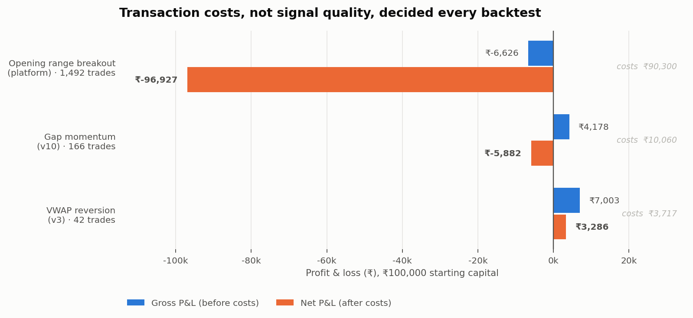

# Results

Every backtest output this project has produced, published in full.

> **These are not investable performance figures.** They are the raw outputs of
> research code that contains known defects, documented in
> [`docs/findings.md`](../docs/findings.md). Several of these numbers are wrong in
> ways I can name precisely. They are published so the reasoning is auditable, not
> because they are claims.

Nothing here is cherry-picked. The worst result is the largest sample.

## Rule-based strategies

Simulated on 5-minute NSE bars, ₹100,000 starting capital, Zerodha cost model
(₹20 flat per leg + 0.1% slippage per side). Trade ledgers are the SQLite exports
from each prototype's actual run.

| Iteration | Trades | Period | Net P&L | Return | Win rate | Profit factor | Max DD |
|---|---:|---|---:|---:|---:|---:|---:|
| [VWAP reversion (v3)](rule_based_v3/) | 42 | Apr 2023 – Mar 2026 | +₹3,286 | +3.3% | 66.7% | 1.76 | −₹742 |
| [Gap momentum (v10)](rule_based_v10/) | 166 | Mar 2021 – Jan 2022 | −₹5,882 | −5.9% | 38.0% | 0.62 | −₹5,780 |
| [Opening range breakout](kite_execution_platform_orb/) | 1,492 | Mar 2021 – Feb 2026 | −₹96,927 | −96.9% | 19.8% | 0.24 | −₹98,011 |

**Read the sample sizes before the returns.** The only profitable line is also the
smallest: 42 trades spread over 36 trading days in three years is not enough to
distinguish skill from noise. The −96.9% line is the one with 1,492 trades over
887 days, and it is the most informative result in this table.

## The finding that explains all three

Decomposing each ledger into gross P&L and transaction costs changes the story
completely:

| Iteration | Gross P&L | Costs | Net P&L | Median position | Cost as % of position |
|---|---:|---:|---:|---:|---:|
| VWAP reversion (v3) | +₹7,003 | ₹3,717 | +₹3,286 | ₹24,537 | 0.36% |
| Gap momentum (v10) | +₹4,178 | ₹10,060 | −₹5,882 | ₹10,410 | 0.59% |
| Opening range breakout | −₹6,626 | ₹90,300 | −₹96,927 | ₹9,456 | 0.62% |

Gap momentum was **gross profitable** and still lost money. The ORB strategy's
gross loss was ₹6,626 — costs turned it into ₹96,927, so **93% of that loss is
friction, not bad signals.** Gross win rate was 46.1%; net win rate 19.8%.

The mechanism is position sizing, not signal quality. A flat ₹20-per-leg brokerage
is 0.42% of a ₹9,500 position and 0.16% of a ₹24,500 one. Risk-based sizing kept
positions small enough that fixed costs dominated the edge. The only strategy that
survived is the one that happened to take positions 2.5× larger.

## Exit-reason distributions

| Iteration | Target | Stop | EOD timeout |
|---|---:|---:|---:|
| VWAP reversion (v3) | 20 | 4 | 18 |
| Gap momentum (v10) | **0** | 60 | 106 |
| Opening range breakout | 124 | 290 | 1,078 |

Gap momentum never reached its target once in 166 trades. ORB timed out in 72% of
trades. In both cases the profit target was unreachable within the holding window
— a strategy-design fault visible in the ledger and invisible in a headline return.

## ML research outputs

- [`intraday_ml_research/`](intraday_ml_research/) — equity curves across five
  probability thresholds, feature importance, and the paper-trading dry-run log
  from 2 and 12 April 2026.
- [`early_ml_pipeline/`](early_ml_pipeline/) — feature importance rankings,
  threshold sweeps, and filtered signal sets from the LightGBM/meta-model era.

Both carry significant caveats. See [`docs/findings.md`](../docs/findings.md).
